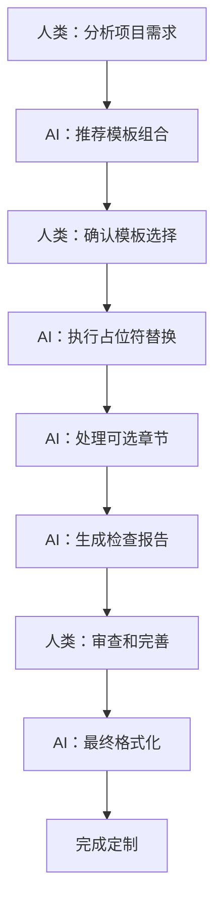

# 文档模板定制详细指南

## 📖 概述

本指南详细说明如何使用和定制文档模板库中的各种模板，帮助开发者和AI助手协作快速建立适合项目的文档体系。

### 🎯 适用对象
- **人类开发者**：理解定制策略，做出项目决策
- **AI助手**：执行具体操作，进行自动化处理
- **团队协作**：建立统一的文档标准和流程

## 🚀 快速开始

### 基础定制流程
1. **需求分析** → 确定项目类型和复杂度
2. **模板选择** → 选择适合的模板组合
3. **占位符替换** → 批量替换项目信息
4. **章节调整** → 删除不适用的可选章节
5. **内容完善** → 添加项目特定内容
6. **质量检查** → 验证文档完整性和一致性

### 🤖 AI助手操作要点
- 识别并处理所有 `[占位符]` 格式的内容
- 处理 `<!-- 可选：... -->` 标记的章节
- 验证文档间的交叉引用链接
- 生成定制完成报告

## 📋 详细定制步骤

### 步骤1：项目需求分析

#### 🔍 项目类型识别（AI可自动检测）

**AI协作项目特征：**
```markdown
检测关键词：AI助手、自动化、智能协作
推荐模板：
- ai-guidelines/ai-working-constraints.md ✅ 必需
- ai-guidelines/ai-working-constraints-web.md（如果是Web项目）
- project-constraints.md ✅ 必需
```

**Web开发项目特征：**
```markdown
检测关键词：前端、后端、部署、域名、服务器
推荐模板：
- project-deployment.md ✅ 推荐
- project-structure.md ✅ 推荐
- project-troubleshooting.md ✅ 推荐
```

**通用项目特征：**
```markdown
检测关键词：版本管理、项目历史、背景分析
推荐模板：
- project-version.md（如有版本管理需求）
- project-background.md（如需详细背景说明）
- project-history-and-status.md（如需历史跟踪）
```

#### 📊 复杂度评估表

| 项目规模 | 团队人数 | 开发周期 | 推荐模板数量 | 核心模板 |
|----------|----------|----------|-------------|----------|
| **小型** | 1-3人 | 1-3个月 | 3-4个 | AI约束 + 项目约束 + 问题排查 |
| **中型** | 3-10人 | 3-12个月 | 5-7个 | + 部署指南 + 项目结构 + 版本管理 |
| **大型** | 10+人 | 12个月+ | 8-10个 | + 项目背景 + 历史跟踪 + 完整AI指南 |

### 步骤2：占位符替换指南

#### 🔧 必需占位符替换表

| 占位符 | 说明 | 搜索正则 | 替换示例 | AI处理方式 |
|--------|------|----------|----------|------------|
| `[项目名称]` | 项目完整中文名称 | `\[项目名称\]` | "在线学习平台" | 全局替换 |
| `[项目英文名]` | 项目英文标识符 | `\[项目英文名\]` | "online-learning-platform" | 全局替换 |
| `[技术栈]` | 主要技术栈 | `\[技术栈.*?\]` | "React + Node.js + MongoDB" | 上下文替换 |
| `[开发端口]` | 开发服务器端口 | `\[开发端口\]` | "3000" | 全局替换 |
| `[部署域名]` | 生产环境域名 | `\[部署域名\]` | "https://your-domain.com" | 全局替换 |

#### 🤖 AI自动化替换脚本示例

```python
# AI可以使用的占位符替换逻辑
def replace_placeholders(content, project_info):
    replacements = {
        r'\[项目名称\]': project_info['name'],
        r'\[项目英文名\]': project_info['english_name'],
        r'\[技术栈.*?\]': project_info['tech_stack'],
        r'\[开发端口\]': project_info['dev_port'],
        r'\[部署域名\]': project_info['domain']
    }
    
    for pattern, replacement in replacements.items():
        content = re.sub(pattern, replacement, content)
    
    return content
```

#### 🔗 链接和引用处理

**占位符链接识别：**
```markdown
# 需要AI处理的占位符链接格式
- **[框架名称]官方文档** - [根据实际框架添加官方文档链接]
- **[工具名称]** - [根据实际工具添加相关链接]

# AI处理逻辑
1. 搜索模式：`\[根据.*?添加.*?链接\]`
2. 提示用户：需要为 [框架名称] 提供官方文档链接
3. 替换格式：将占位符替换为实际URL
```

**AI处理步骤：**
1. 扫描文档中的所有占位符链接
2. 生成需要用户提供的链接清单
3. 获得用户输入后批量替换
4. 验证链接格式的正确性

### 步骤3：可选章节处理

#### 🏷️ 可选章节标记识别

**标记格式：**
```html
<!-- 可选：如果有服务器部署 -->
## 🌐 服务器部署架构
...章节内容...
<!-- 服务器部署结束 -->
```

**AI处理逻辑：**
```python
def process_optional_sections(content, project_requirements):
    # 1. 识别所有可选章节
    optional_sections = re.findall(
        r'<!-- 可选：(.*?) -->(.*?)<!-- .*?结束 -->',
        content, re.DOTALL
    )
    
    # 2. 根据项目需求决定保留或删除
    for section_desc, section_content in optional_sections:
        if should_keep_section(section_desc, project_requirements):
            # 保留章节，删除标记注释
            content = remove_section_markers(content, section_desc)
        else:
            # 删除整个章节
            content = remove_entire_section(content, section_desc)
    
    return content
```

#### 📝 常见可选章节决策表

| 可选章节 | 保留条件 | AI判断关键词 | 处理建议 |
|----------|----------|-------------|----------|
| 服务器部署 | 需要服务器部署 | "服务器"、"部署"、"域名" | 询问用户 |
| 移动端问题 | 涉及移动端开发 | "移动端"、"响应式"、"触摸" | 自动判断 |
| Docker部署 | 使用容器化 | "Docker"、"容器"、"镜像" | 询问用户 |
| SEO优化 | 需要SEO | "SEO"、"搜索引擎"、"sitemap" | 自动判断 |
| 商业模式 | 商业项目 | "商业"、"付费"、"盈利" | 询问用户 |

### 步骤4：文档间关联处理

#### 🔗 交叉引用更新

**AI自动检测和更新：**
```python
def update_cross_references(files, renamed_files):
    # 检测所有 [文档名](./path.md) 格式的引用
    reference_pattern = r'\[([^\]]+)\]\(\.\/([^)]+\.md)\)'
    
    for file_path, content in files.items():
        # 查找所有引用
        references = re.findall(reference_pattern, content)
        
        for ref_text, ref_path in references:
            # 检查引用的文件是否存在或被重命名
            if ref_path in renamed_files:
                # 更新引用路径
                new_path = renamed_files[ref_path]
                content = content.replace(f'](./{ref_path})', f'](./{new_path})')
        
        files[file_path] = content
```

#### 📂 目录结构调整

**AI处理规则：**
1. **检测文件重命名**：比较模板文件名和实际文件名
2. **更新所有引用**：自动更新文档间的相对路径
3. **验证链接有效性**：确保所有内部链接都指向存在的文件
4. **生成引用报告**：列出所有文档间的依赖关系

## 🔧 高级定制技巧

### 1. 模板组合策略

#### 🎯 渐进式采用（推荐给AI）

```markdown
# AI推荐的采用顺序
阶段1 - 核心基础（必需）:
1. ai-guidelines/ai-working-constraints.md
2. project-constraints.md

阶段2 - 开发支持（推荐）:
3. project-troubleshooting.md
4. project-deployment.md

阶段3 - 项目管理（可选）:
5. project-structure.md
6. project-version.md

阶段4 - 完整体系（大型项目）:
7. project-background.md
8. project-history-and-status.md
```

#### 🧩 模块化定制

**AI可以根据项目特征自动推荐：**

```python
def recommend_templates(project_info):
    templates = []
    
    # 基础模块（所有项目）
    templates.extend(['ai-working-constraints.md', 'project-constraints.md'])
    
    # Web开发模块
    if 'web' in project_info['type'].lower():
        templates.extend([
            'ai-working-constraints-web.md',
            'project-deployment.md',
            'project-troubleshooting.md'
        ])
    
    # 企业级模块
    if project_info['scale'] == 'large':
        templates.extend([
            'project-version.md',
            'project-history-and-status.md',
            'project-background.md'
        ])
    
    return templates
```

### 2. 自定义占位符系统

#### 🏗️ 创建项目特定占位符

**AI可以识别和处理的扩展占位符：**

```markdown
# 技术栈相关
[数据库类型] → MySQL/PostgreSQL/MongoDB
[缓存系统] → Redis/Memcached
[消息队列] → RabbitMQ/Kafka
[监控系统] → Prometheus/Grafana

# 部署相关
[容器平台] → Docker/Kubernetes
[云服务商] → AWS/Azure/阿里云
[CI/CD工具] → GitHub Actions/Jenkins

# 团队相关
[团队规模] → 小型团队(1-5人)/中型团队(5-15人)/大型团队(15+人)
[开发模式] → 敏捷开发/瀑布模型/DevOps
```

#### 📏 占位符命名规范（AI友好）

**规范要求：**
- 使用中括号包围：`[占位符名称]`
- 使用描述性名称：`[API服务器地址]` 而不是 `[地址1]`
- 保持一致性：同一概念使用相同占位符
- 支持嵌套：`[技术栈，如：React + Node.js]`

**AI处理优先级：**
1. **必需占位符**：项目无法运行时缺少的信息
2. **推荐占位符**：影响功能完整性的信息  
3. **可选占位符**：增强文档质量的信息

## � 质文档管理最佳实践

### � 避免文动档重复创建

**核心原则：新建文档前必须先检查现有文档**

**AI检查流程：**
```python
def check_existing_documents(new_doc_purpose, existing_docs):
    # 1. 搜索相似用途的文档
    similar_docs = search_similar_purpose(new_doc_purpose, existing_docs)
    
    # 2. 检查文档类型匹配
    type_matches = find_type_matches(new_doc_purpose, existing_docs)
    
    # 3. 评估扩展可行性
    extensible_docs = find_extensible_docs(new_doc_purpose, existing_docs)
    
    return {
        'similar_docs': similar_docs,
        'type_matches': type_matches,
        'extensible_docs': extensible_docs,
        'recommendation': generate_recommendation()
    }
```

**人类决策要点：**
- **功能重叠度**：新文档与现有文档的功能重叠程度
- **维护成本**：多个文档vs单个文档的维护复杂度
- **用户体验**：文档分散vs集中对用户的影响
- **团队习惯**：团队更偏好详细分类还是集中管理

**推荐决策流程：**
1. **优先扩展现有文档**（推荐指数：⭐⭐⭐⭐⭐）
2. **整合相关文档内容**（推荐指数：⭐⭐⭐⭐）
3. **创建新的专门文档**（推荐指数：⭐⭐⭐）

## 🔍 质量检查和验证

### 📋 AI自动检查清单

```python
def quality_check(processed_files):
    issues = []
    
    # 1. 占位符检查
    for file_path, content in processed_files.items():
        remaining_placeholders = re.findall(r'\[([^\]]+)\]', content)
        if remaining_placeholders:
            issues.append(f"{file_path}: 未处理的占位符 {remaining_placeholders}")
    
    # 2. 链接有效性检查
    for file_path, content in processed_files.items():
        links = re.findall(r'\[([^\]]+)\]\(([^)]+)\)', content)
        for link_text, link_url in links:
            if link_url.startswith('./') and not file_exists(link_url):
                issues.append(f"{file_path}: 无效的内部链接 {link_url}")
    
    # 3. 必需章节检查
    required_sections = ['文档目的', '项目概述']
    for file_path, content in processed_files.items():
        for section in required_sections:
            if section not in content:
                issues.append(f"{file_path}: 缺少必需章节 {section}")
    
    return issues
```

### ✅ 人工审查要点

**开发者需要检查的内容：**
1. **业务逻辑正确性** - AI无法判断的业务规则
2. **团队协作适配性** - 是否符合团队工作习惯
3. **项目特殊需求** - 行业特定或合规要求
4. **文档可读性** - 语言表达和逻辑流畅性

## 🔄 维护和更新

### 📅 定期维护计划

**AI可以协助的维护任务：**
- **周度检查**：扫描文档中的过时链接和信息
- **月度更新**：检查技术栈版本更新，提醒相关文档修改
- **季度优化**：分析文档使用情况，建议结构优化

**人工主导的维护任务：**
- **需求变更适配**：根据项目发展调整约束和规范
- **团队反馈整合**：收集使用体验，改进文档内容
- **最佳实践更新**：基于项目经验更新指导内容

### 📊 版本管理

**版本号规则（AI可自动管理）：**
```markdown
格式：主版本.次版本.修订号 (v1.2.3)

主版本号：重大结构调整，不兼容旧版本
次版本号：功能性更新，向后兼容
修订号：错误修复和小调整

AI自动更新条件：
- 修订号：修复占位符、链接等技术问题
- 次版本号：添加新的可选章节或占位符
- 主版本号：需要人工决策的重大变更
```

## 🤝 AI-人类协作最佳实践

### 🎯 分工原则

**AI负责：**
- 占位符识别和批量替换
- 格式检查和标准化
- 链接有效性验证
- 重复性操作执行
- 质量检查报告生成

**人类负责：**
- 项目需求分析和决策
- 业务逻辑验证
- 创意内容创作
- 最终质量审查
- 团队协调和沟通

### 💡 协作流程



---

**指南版本**：v1.0  
**创建日期**：2025-08-27  
**适用范围**：文档模板库定制  
**维护状态**：活跃维护  
**协作模式**：AI-人类协作

**使用建议**：
- **首次使用**：人类阅读理解策略，AI执行具体操作
- **问题解决**：查阅相关章节，AI协助定位和修复
- **持续维护**：建立定期检查机制，AI-人类分工协作
- **经验反馈**：向模板库反馈使用体验，持续改进